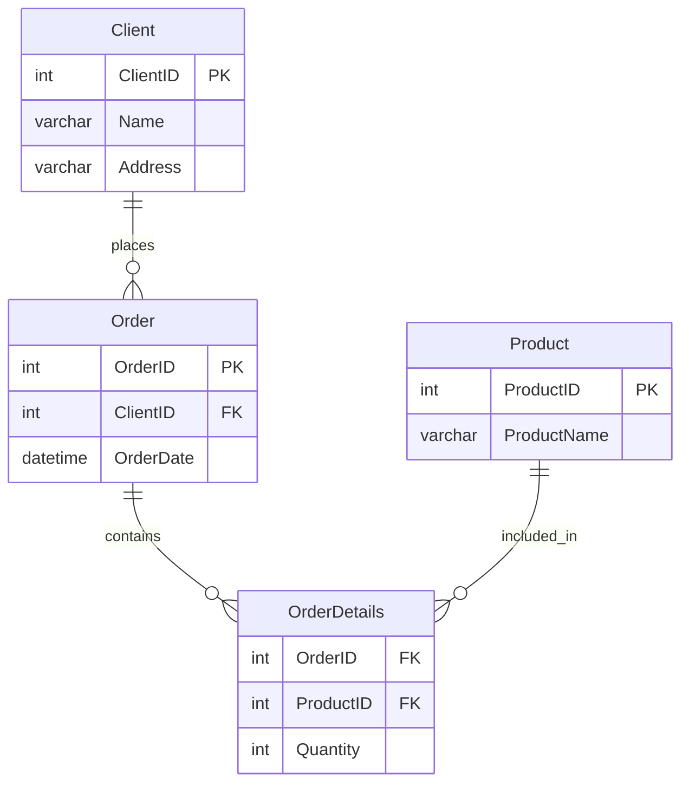
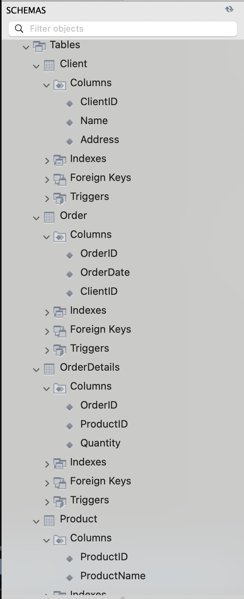

# Homework 2

| Номер_замовлення | Назва_товару і кількість | Адреса_клієнта | Дата замовлення |  Клієнт   |
| :--------------: | :----------------------: | :------------: | :-------------: | :-------: |
|       101        |   Лептоп: 3, Мишка: 2    |   Хрещатик 1   |   2023-03-15    |  Мельник  |
|       102        |        Принтер: 1        |   Басейна 2    |   2023-03-16    | Шевченко  |
|       103        |         Мишка: 4         | Комп'ютерна 3  |   2023-03-17    | Коваленко |

## 1. Переведіть початкову таблицю в першу нормальну форму

**Перша нормальна форма (1NF)** - кожна комірка таблиці містить тільки атомарні (неподільні) значення, немає повторюваних груп.

| OrderID | ProductName | Quantity |    Address    | OrderDate  |   Name    |
| :-----: | :---------: | :------: | :-----------: | :--------: | :-------: |
|   101   |   Лептоп    |    3     |  Хрещатик 1   | 2023-03-15 |  Мельник  |
|   101   |    Мишка    |    2     |  Хрещатик 1   | 2023-03-15 |  Мельник  |
|   102   |   Принтер   |    1     |   Басейна 2   | 2023-03-16 | Шевченко  |
|   103   |    Мишка    |    4     | Комп'ютерна 3 | 2023-03-17 | Коваленко |

## 2. Переведіть нові таблиці в другу нормальну форму

**Друга нормальна форма (2NF)** - таблиця знаходиться в 1NF і всі неключові атрибути повністю залежать від первинного ключа (немає часткових залежностей).

**Проблема в 1NF:** Атрибути "Address", "OrderDate", "Name" залежать тільки від "OrderID", а не від повного ключа (OrderID + ProductName).

**Рішення:** Розділити таблиці

### Таблиця 1: Orders

| OrderID |    Address    | OrderDate  |   Name    |
| :-----: | :-----------: | :--------: | :-------: |
|   101   |  Хрещатик 1   | 2023-03-15 |  Мельник  |
|   102   |   Басейна 2   | 2023-03-16 | Шевченко  |
|   103   | Комп'ютерна 3 | 2023-03-17 | Коваленко |

#### Таблиця 2: OrderDetails

| OrderID | ProductName | Quantity |
| :-----: | :---------: | :------: |
|   101   |   Лептоп    |    3     |
|   101   |    Мишка    |    2     |
|   102   |   Принтер   |    1     |
|   103   |    Мишка    |    4     |

## 3. Переведіть нові таблиці в третю нормальну форму

**Третя нормальна форма (3NF)** - таблиця знаходиться в 2NF і немає транзитивних залежностей (неключові атрибути не залежать від інших неключових атрибутів).

**Проблема в 2NF:** В таблиці "Orders" атрибут "Address" залежить від "Name", а не безпосередньо від "OrderID" (транзитивна залежність).

**Рішення:** Розділити таблиці. Також винесемо Product в окрему таблицю - для цього конкретного завдання це необов'язково, але у реальній ситуації це неминуче.

### Таблиця 1: Client

| ClientID (PK) | Name      | Address       |
| ------------- | --------- | ------------- |
| 1             | Мельник   | Хрещатик 1    |
| 2             | Шевченко  | Басейна 2     |
| 3             | Коваленко | Комп'ютерна 3 |

#### Таблиця 2: Orders

| OrderID (PK) | ClientID (FK) | OrderDate  |
| ------------ | ------------- | ---------- |
| 101          | 1             | 2023-03-15 |
| 102          | 2             | 2023-03-16 |
| 103          | 3             | 2023-03-17 |

#### Таблиця 3: Products

| ProductID (PK) | ProductName |
| -------------- | ----------- |
| 1              | Лептоп      |
| 2              | Мишка       |
| 3              | Принтер     |

#### Таблиця 4: OrderDetails

| OrderID (FK) | ProductID (FK) | Quantity |
| ------------ | -------------- | -------- |
| 101          | 1              | 3        |
| 101          | 2              | 2        |
| 102          | 3              | 1        |
| 103          | 2              | 4        |

## 4. Entity Relationship Diagram

- **Client → Order**: Один клієнт може мати багато замовлень (1:N)
- **Order → OrderDetails**: Одне замовлення може містити багато позицій (1:N)
- **Product → OrderDetails**: Один товар може бути в багатьох позиціях замовлень (1:N)
- **OrderDetails**: Проміжна таблиця з композитним первинним ключем (OrderID, ProductID)

## 5. Database

**[SQL schema and data](db.sql)**

